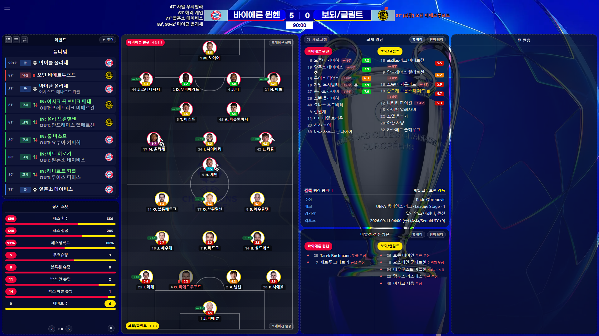
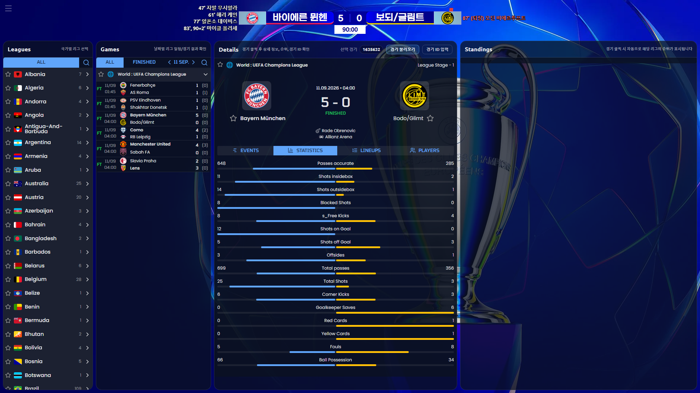
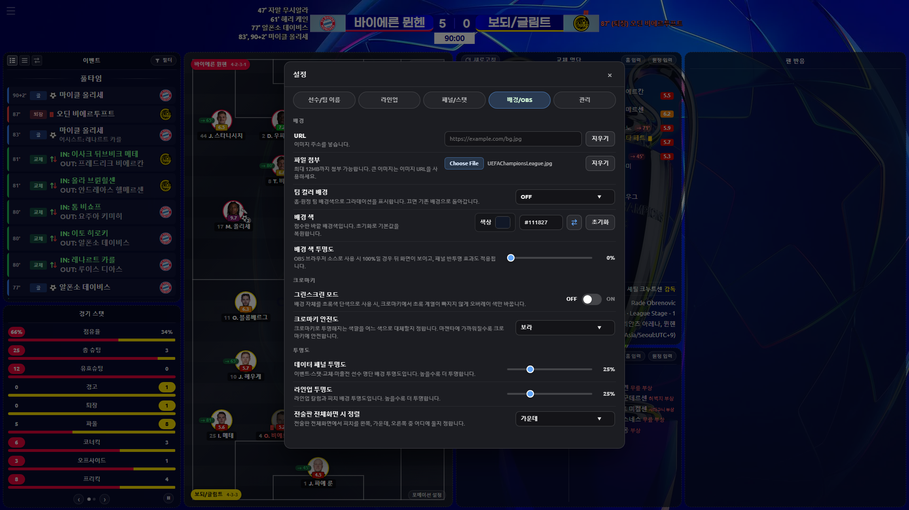
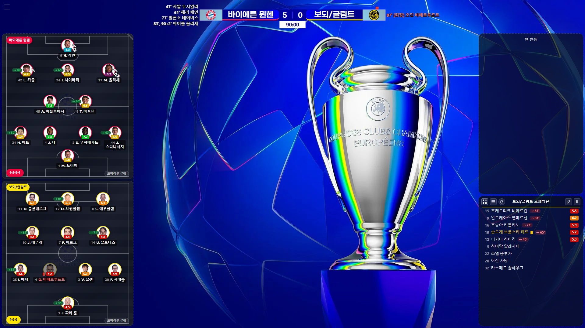
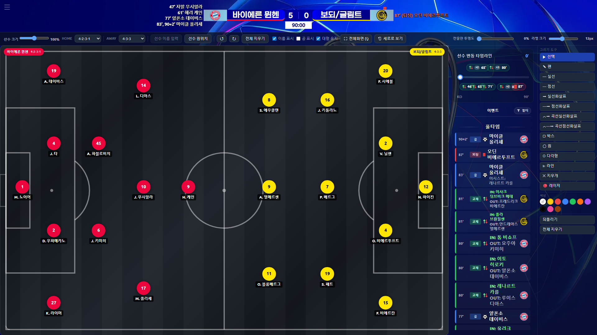

# OBS Football Dashboard

경기 ID 하나로 축구 경기의 점수, 시간, 득점자, 라인업, 이벤트, 경기 스탯을 OBS 방송 화면에 띄우는 웹 대시보드입니다. 설치 없이 브라우저에서 바로 사용할 수 있습니다.

**바로 사용하기: <https://football-obs-frontend.vercel.app>**



## 목차

- [무엇을 할 수 있나요](#무엇을-할-수-있나요)
- [처음 사용하기](#처음-사용하기)
- [OBS에서 사용하기](#obs에서-사용하기)
- [화면 예시](#화면-예시)
- [지원 환경과 제약](#지원-환경과-제약)
- [더 알아보기](#더-알아보기)
- [문의와 기여](#문의와-기여)
- [데이터 출처와 라이선스](#데이터-출처와-라이선스)
- [개발자용 안내](#개발자용-안내)

## 무엇을 할 수 있나요

- **점수판 자동 연동**: 경기 ID를 불러오면 팀 이름, 로고, 점수, 경기 시간, 추가시간, 득점자가 채워지고 진행 중인 경기는 15초마다 갱신됩니다.
- **대회별 점수판 디자인**: 리그에 맞는 FSM 점수판 테마가 자동으로 적용됩니다. 원하는 테마를 직접 고를 수도 있습니다.
- **방송용 정보 패널**: 포메이션 라인업, 문자중계 이벤트, 경기 스탯, 교체·미출전 선수 명단, 상대전적, 지원 리그의 실시간 순위표를 보여 줍니다.
- **데이터 보정**: API 데이터가 비어 있거나 틀리면 라인업, 교체 선수, 이벤트, 감독·주심·경기장을 화면에서 직접 고칠 수 있습니다.
- **수동 모드**: API가 지원하지 않는 경기도 팀 이름, 로고, 점수, 득점자를 직접 입력해 점수판으로 쓸 수 있습니다.
- **전술판**: 불러온 라인업으로 선수를 배치하고, 교체 시점별 라인업을 확인하고, 화살표·도형을 그릴 수 있습니다.
- **키보드 조작**: 타이머, 승부차기 기록, 화면 이동을 단축키로 조작합니다.

기능별 자세한 설명은 [사용 안내(about.md)](about.md)에 있습니다. 같은 내용을 사이트의 **About** 탭(`6` 키)에서도 볼 수 있습니다.

## 처음 사용하기

1. [대시보드](https://football-obs-frontend.vercel.app)를 Chrome이나 Edge로 엽니다.
2. **일정 확인** 탭(`4` 키)에서 경기를 고르고 **경기 불러오기**를 누릅니다. 경기 ID를 알고 있다면 `7` 키로 입력창을 열어 바로 불러와도 됩니다.
3. **테마** 탭(`3` 키)에서 **FSM 테마 선택**이 **경기에 맞춰 자동**인지 확인합니다.
4. **메인 (캠 큼)**(`1` 키) 또는 **메인 (캠 작음)**(`2` 키)으로 이동해 패널 경계를 드래그하여 방송 구성에 맞춥니다.



왼쪽 위 메뉴 버튼이나 `Tab` 키로 메뉴 사이드바를 열 수 있고, 사이드바의 톱니바퀴 버튼으로 설정을 엽니다. 설정과 수동 입력값은 사용하는 브라우저에 저장됩니다.

API 연동 없이 쓰려면 **테마** 탭의 **수동 모드**를 켜고 팀 이름, 로고, 점수를 입력하세요. `Space` 키로 타이머를 시작하거나 멈춥니다.

## OBS에서 사용하기

1. 브라우저에서 대시보드를 열고 경기와 화면 구성을 맞춥니다. 1920x1080 화면을 기준으로 만들었으며, 같은 16:9 비율의 더 큰 해상도에서도 구도가 유지됩니다.
2. OBS에서 **브라우저 소스**에 사이트 URL을 넣거나, 일반 브라우저를 **윈도우 캡처 / 디스플레이 캡처**로 잡습니다. 일반 브라우저를 캡처할 때는 전체화면(`F11`)을 권장합니다.
3. `H` 키로 메뉴 버튼을 숨겨 방송 화면에서 조작 버튼이 보이지 않게 합니다.
4. 일반 브라우저의 윈도우 캡처에서는 **관리 → 입력창/설정을 새 창으로 열기**로 입력·수정 창을 분리할 수 있습니다. 디스플레이 전체를 캡처하면 새 창도 방송에 보일 수 있습니다. OBS 브라우저 소스에서는 사이트 안의 팝업으로 열리며, 소스의 **상호작용** 창에서 조작합니다.

**브라우저 소스에서 배경을 투명하게 쓰려면** 배경 이미지를 지우고 **배경/OBS → 배경 색 투명도**를 100%로 설정하세요. 그린스크린 모드를 OFF로 두면 반투명 패널도 뒤의 OBS 소스 위에 적용됩니다.

**디스플레이 캡처에서 배경을 제거하려면** 배경 색을 초록으로 맞추고 OBS 크로마키를 적용합니다. **그린스크린 모드**는 대시보드 안의 초록 계열 색을 선택한 안전도에 맞춰 치환하고, 패널·피치·전술판 투명도를 0%로 고정합니다. 크로마키 필터 설정값에 따라 글씨 테두리 일부가 함께 제거될 수 있으니, 송출 화면을 보면서 필터 설정을 조절해 주세요.

OBS **브라우저 소스**로 쓸 때는 소스의 너비·높이를 방송 구성에 맞춰 지정하세요. 브라우저 소스는 일반 브라우저와 저장 공간이 따로라서 설정을 다시 맞춰야 할 수 있습니다.

캡처 범위·투명도·팝업 동작에 관한 자세한 설명은 [송출 방식에 따른 차이](about.md#송출-방식에-따른-차이)를 참고하세요.



## 화면 예시

| 메인 (캠 큼) | 전술판 |
| --- | --- |
|  |  |

캠 큼 화면의 빈 가운데 영역은 스트리머 캠을 놓는 자리입니다.

## 지원 환경과 제약

| 항목 | 내용 |
| --- | --- |
| 브라우저 | Chrome 또는 Chromium 기반 브라우저(Edge 등). Firefox에서는 기기에 설치된 글꼴을 불러오지 못합니다. |
| 화면 | 1920x1080 기준. Windows 배율과 브라우저 확대도 보정합니다. 태블릿에서는 전술판 터치 배치를 지원합니다. |
| 저장 | 설정, 수동 입력, 닉네임은 브라우저 저장소에 남습니다. 다른 브라우저나 기기, OBS 브라우저 소스와는 공유되지 않습니다. |

데이터 관련 제약:

- 리그와 경기마다 제공되는 데이터 범위가 다릅니다. 하위 리그에서는 포메이션, 팀 컬러, 미출전 선수, 추가시간 정보가 없거나 부정확할 수 있습니다.
- 경기 종료 후 데이터 보정 과정에서 승부차기 순서나 추가시간 득점 시각이 사라질 수 있습니다. 최종 승부차기 점수는 그대로 표시됩니다.
- 실시간 순위표는 ScoreAxis 위젯을 지원하는 리그에서만 표시됩니다.
- 짧은 시간에 경기를 연속으로 많이 조회하면 몇 초 동안 조회가 제한됩니다. 제한이 풀리면 자동으로 다시 시도합니다.
- 화면에서 고친 내용은 이 대시보드에만 적용되며 API 원본 데이터를 바꾸지 않습니다.

데이터가 비어 있거나 잘못 보일 때의 대처 방법은 [사용 안내의 해당 항목](about.md#데이터가-없거나-잘못-표시될-때)을 참고하세요.

## 더 알아보기

- [사용 안내(about.md)](about.md): 탭별 기능, 설정, 키보드 단축키, 데이터 보정 방법
- [변경 이력(CHANGELOG.md)](CHANGELOG.md): 버전별 변경 내용
- [GitHub Releases](https://github.com/bgh1234554/football-obs-frontend/releases): 출시된 버전과 출시 안내

## 문의와 기여

- 버그 제보와 기능 제안: [GitHub Issues](https://github.com/bgh1234554/football-obs-frontend/issues)
- 질문과 의견: [GitHub Discussions](https://github.com/bgh1234554/football-obs-frontend/discussions) 또는 [이메일](mailto:bgh1234554@gmail.com)
- 선수·팀·경기장 한글 표기나 로고가 어색하거나 오래된 경우에도 알려 주세요.

버그를 제보할 때는 경기 ID, 사용한 탭, 브라우저 종류, 화면 캡처를 함께 적어 주시면 확인이 빠릅니다. 코드 변경을 제안하려면 먼저 Issue로 내용을 공유해 주세요.

프로젝트가 도움이 되었다면 [Buy Me a Coffee](https://www.buymeacoffee.com/bgh1234554)로 후원할 수 있습니다.

## 데이터 출처와 라이선스

- 경기 데이터: [API-Football](https://www.api-football.com/) v3 (유료 요금제)
- 팀 로고와 선수 사진: API-Football 미디어(BunnyCDN 캐싱), 일부 커스텀 로고는 Wikipedia 등에서 수집해 [별도 저장소](https://github.com/bgh1234554/football-obs-logo-cdn)에 보관
- 일정 확인 탭: api-sports.io 공식 위젯
- 실시간 순위표: ScoreAxis 위젯
- 점수판 디자인: FSM 점수판 디자인은 제작자 인디벨님의 허락을 받아 사용합니다.

데이터, 로고, 선수 사진, 점수판 디자인, 글꼴의 권리는 각 제공자와 권리자에게 있으며 이용 조건도 각 제공자의 정책을 따릅니다.

이 저장소에는 아직 오픈소스 라이선스가 지정되어 있지 않습니다. 코드를 다른 곳에 사용하거나 배포하려면 먼저 문의해 주세요.

## 개발자용 안내

이 저장소는 빌드 과정이 없는 정적 프런트엔드(HTML, CSS, Vanilla JS)입니다. 경기 데이터는 별도 저장소의 [Spring Boot 백엔드](https://github.com/bgh1234554/football-obs-backend)에서 받아옵니다.

로컬에서 실행하려면 저장소 루트에서 정적 파일 서버를 띄우고 `overlay_dashboard.html`을 엽니다.

```bash
python -m http.server 8000
# 브라우저에서 http://localhost:8000/overlay_dashboard.html
```

배포 환경의 `/schedule`, `/about` 같은 주소는 [vercel.json](vercel.json)의 rewrite로 처리됩니다. 로컬 정적 서버에서는 `#/about` 형태의 주소로 동작합니다.

테스트 실행 방법은 [tests/README.md](tests/README.md), 파일 구조는 [docs/structure.md](docs/structure.md), 백엔드 응답 형식은 [docs/api-endpoints.md](docs/api-endpoints.md), 릴리즈 절차는 [docs/releasing.md](docs/releasing.md)를 참고하세요.
