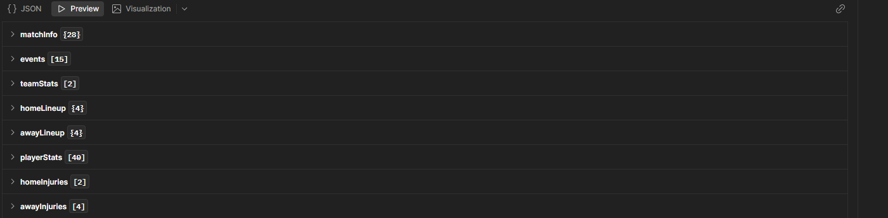

# 프런트 개발자용 백엔드 API 문서
- 백엔드 Base URL: `https://football-obs-backend.onrender.com`
- 프런트 호출 기준: `js/api.js`
- 백엔드 공개 컨트롤러: `../football-obs-backend/src/main/java/com/github/baek/footballobsbackend/web`
- 백엔드 DTO 기준: `../football-obs-backend/src/main/java/com/github/baek/footballobsbackend/dto`
- API-Football 참고 문서: `https://www.api-football.com/documentation-v3`

## 공통 규칙
### Authorization 방식
| 항목 | 설명 |
| --- | --- |
| Authorization Type | 없음 |
| API-Football API key | 프런트에 노출하지 않는다. 백엔드 `ApiFootballClient`가 BunnyCDN 경유로 API-Football을 호출한다. |

### Error Response
백엔드는 예외 처리 방식으로 `ApiException`을 `ErrorResult` 형태로 반환한다.

| key | 설명 | value 타입 | 옵션 | Nullable | 예시 |
| --- | --- | --- | --- | --- | --- |
| code | 백엔드 에러 코드 | String | Enum | X | `STAT_NOT_AVAILABLE` |
| message | 사용자 표시 가능한 에러 메시지 | String |  | X | `해당 선수에 대한 스탯이 제공되지 않습니다.` |
| status | HTTP status code | Integer |  | X | `404` |
| path | 요청 path | String |  | X | `/api/playerStats/276` |
| timestamp | 서버 에러 발생 시각 | String | ISO-8601 | X | `2026-04-23T05:23:10.123Z` |

**Example**

```json
{
  "code": "STAT_NOT_AVAILABLE",
  "message": "해당 선수에 대한 스탯이 제공되지 않습니다.",
  "status": 404,
  "path": "/api/playerStats/276",
  "timestamp": "2026-04-23T05:23:10.123Z"
}
```

### Status

| status | response content |
| --- | --- |
| 200 | 조회 성공 |
| 404 | 조회 대상 없음 또는 원본 API-Football 데이터 없음 |
| 429 | 백엔드 rate limit 초과 |
| 500 | 서버 내부 오류 |

> 구현 주의: `GET /api/fixtures/{fixtureId}`는 현재 서비스에서 원본 fixture가 없을 때 `null`을 반환할 수 있다. 코드 주석과 `FIXTURE_NOT_FOUND` 에러 코드는 404 의도로 보이지만, 컨트롤러 구현상 `200 null` 가능성이 있으므로 프런트에서는 `data === null`도 방어한다.

### Rate limit (429) 응답 헤더

429 응답에는 다음 헤더 중 하나가 함께 내려올 수 있다. 프런트(`js/api.js`의 `apiFetch`)는 두 헤더를 모두 인식해 자동 재시도(최대 2회) 시 대기시간을 결정한다.

| Header | 단위 | 설명 |
| --- | --- | --- |
| `X-Retry-After-Millis` | 밀리초 | 백엔드 커스텀 헤더. 토큰 버킷의 다음 충전까지 남은 시간을 ms로 내린다 |
| `Retry-After` | 초 또는 HTTP-date | RFC 7231 표준 헤더. 정수면 초, 그 외엔 ISO 날짜 |

> CORS 주의: 위 두 헤더는 백엔드 `Access-Control-Expose-Headers`에 노출돼 있어야 브라우저 fetch에서 읽을 수 있다. 노출되지 않은 경우 프런트는 5초 fallback으로 재시도한다.

대기시간 결정 우선순위 (api.js 기준):
1. `X-Retry-After-Millis` 값(ms)
2. `Retry-After` (초 또는 HTTP-date)
3. fallback `5000ms`

경계 타이밍 회피용으로 응답값에 추가 `+300ms` 버퍼를 더한다.

## 엔드포인트 요약

| Method | Endpoint | 설명 | 주요 사용처 |
| --- | --- | --- | --- |
| GET | `/api/fixtures/{fixtureId}` | 경기 기본 정보, 이벤트, 팀 스탯, 라인업, 선수 경기 스탯, 부상/결장 목록 | 점수판, 라인업, 전술판, 선수 클릭 팝업 |
| GET | `/api/playerStats/{playerId}` | 선수 기본 정보와 시즌별 대회 스탯 | 선수 상세 스탯 팝업 |
| GET | `/api/hth?teamA={teamA}&teamB={teamB}` | 두 팀 상대 전적 | 상대 전적 패널 |

---

## GET `/api/fixtures/{fixtureId}`

경기 ID 하나로 OBS 오버레이에 필요한 경기 전체 데이터를 조회한다. 내부적으로 API-Football `/fixtures?id={fixtureId}`와 `/injuries?ids={fixtureId}`를 호출하고, 서비스 레이어에서 한글명/커스텀 로고/CDN URL을 적용해 `FixtureResponseDto`로 재배치한다.

### Request

| key | 설명 | value 타입 | 옵션 | Nullable | 예시 |
| --- | --- | --- | --- | --- | --- |
| fixtureId | API-Football fixture id | Long | Path variable | X | `215662` |

**Query parameter**

없음.

### API-Football 원본과 우리 DTO의 대조

| 우리 응답 섹션 | 원본 API-Football 필드/엔드포인트 | 참고 내용 |
| --- | --- | --- |
| `matchInfo` | `/fixtures?id={fixtureId}`의 `fixture`, `league`, `teams`, `goals`, `score` | fixture id, status, elapsed, venue, referee, league, team, score, penalty score |
| `events` | `/fixtures?id={fixtureId}`의 `events` 또는 `/fixtures/events` | `Goal`, `Card`, `subst`, `Var` 이벤트와 `detail`, `comments` |
| `teamStats` | `/fixtures?id={fixtureId}`의 `statistics` 또는 `/fixtures/statistics` | 슈팅, 점유율, 카드, 패스 등 팀 단위 통계 |
| `homeLineup`, `awayLineup` | `/fixtures?id={fixtureId}`의 `lineups` 또는 `/fixtures/lineups` | 포메이션, 감독, 선발/교체, 유니폼 색상, grid 포지션 |
| `playerStats` | `/fixtures?id={fixtureId}`의 `players` 또는 `/fixtures/players` | 해당 경기 선수별 출전/슈팅/패스/수비/카드 스탯 |
| `homeInjuries`, `awayInjuries` | `/injuries?ids={fixtureId}` | 결장 유형과 사유. API-Football 문서 기준 `Missing Fixture`, `Questionable` 유형 가능 |

API-Football 문서상 `/fixtures?id={id}` 요청은 이벤트, 라인업, 팀 스탯, 선수 경기 스탯을 같은 응답 안에 포함할 수 있다. 라인업은 대회 커버리지에 따라 경기 20~40분 전부터 제공될 수 있고, 미제공 대회에서는 경기 후 지연 반영될 수 있다.

### Response

위와 같은 구조로 크게 구성되어 있다.
#### `FixtureResponseDto`

| key | 설명 | value 타입 | 옵션 | Nullable | 예시 |
| --- | --- | --- | --- | --- | --- |
| matchInfo | 경기 기본 정보 | Object | `MatchInfoDto` | X | `{...}` |
| events | 득점, 카드, 교체, VAR 이벤트 | Array | `EventDto[]` | X | `[]` |
| teamStats | 홈/원정 팀 스탯 | Array | `TeamStatsDto[]` | X | `[{ "side": "home" }]` |
| homeLineup | 홈팀 라인업 | Object | `LineupDto` | O | `null` |
| awayLineup | 원정팀 라인업 | Object | `LineupDto` | O | `null` |
| playerStats | 해당 경기 선수별 스탯 | Array | `PlayerStatsDto[]` | X | `[]` |
| homeInjuries | 홈팀 부상/결장 | Array | `InjuryDto[]` | X | `[]` |
| awayInjuries | 원정팀 부상/결장 | Array | `InjuryDto[]` | X | `[]` |

각 DTO 안에 있는 DTO의 경우에는 하단 설명을 참조
#### `matchInfo`

| key | 설명 | value 타입 | 옵션 | Nullable | 예시 |
| --- | --- | --- | --- | --- | --- |
| fixtureId | 경기 ID | Long |  | X | `215662` |
| leagueId | 리그 ID | Integer | API-Football 기준 | O | `39` |
| leagueName | 리그명. 한글 우선, 없으면 API-Football 영문 | String |  | X | `Premier League` |
| leagueRound | 라운드명 | String | API 원문 | O | `Regular Season - 19` |
| kickoffAt | 경기 시작 시각 | String | ISO 8601 (UTC offset 포함). 프런트는 `kickoffAt` 우선, 없으면 legacy `kickoffUtc`로 fallback. NS 상태에서 폴링 시작 시각 결정에 사용 | O | `2026-04-25T23:30:00+00:00` |
| leagueLogoUrl | 리그 로고 URL | String | CDN/CSV 적용 | O | `https://.../leagues/39.png` |
| venueName | 경기장명. 한글 우선 | String |  | O | `Old Trafford` |
| venueCity | 도시명. 한글 우선 | String |  | O | `Manchester` |
| status | 프런트용 경기 상태 | String | Enum | X | `1H`, `HT`, `2H`, `ET1`, `ET2`, `PSO`, `FT`, `NS` |
| elapsed | 경기 경과 분 | Integer |  | X | `67` |
| extra | 추가시간 분 | Integer |  | O | `4` |
| homeTeamId | 홈팀 ID | Long |  | X | `33` |
| homeTeamName | 홈팀 풀네임 | String | 한글 우선 | X | `맨체스터 유나이티드` |
| homeTeamNameShort | 홈팀 단축명 | String | 한글 단축명 fallback | X | `맨 유나이티드` |
| homeTeamLogo | 홈팀 로고 URL | String | CDN/CSV 적용 | O | `https://.../teams/33.png` |
| homeTeamFaUrl | 홈팀 협회 로고 URL | String | 국가대표팀용 | O | `null` |
| homeScore | 홈 득점. 정규+연장 합산 | Integer | API `goals.home` | X | `2` |
| homePenaltyScore | 홈 승부차기 득점 | Integer | API `score.penalty.home` | O | `4` |
| homePrimaryColor | 홈 유니폼 배경색 | String | Hex, `#` 없음 | O | `5badff` |
| homeNumberColor | 홈 등번호 색 | String | Hex, `#` 없음 | O | `ffffff` |
| awayTeamId | 원정팀 ID | Long |  | X | `34` |
| awayTeamName | 원정팀 풀네임 | String | 한글 우선 | X | `뉴캐슬` |
| awayTeamNameShort | 원정팀 단축명 | String | 한글 단축명 fallback | X | `뉴캐슬` |
| awayTeamLogo | 원정팀 로고 URL | String | CDN/CSV 적용 | O | `https://.../teams/34.png` |
| awayTeamFaUrl | 원정팀 협회 로고 URL | String | 국가대표팀용 | O | `null` |
| awayScore | 원정 득점. 정규+연장 합산 | Integer | API `goals.away` | X | `1` |
| awayPenaltyScore | 원정 승부차기 득점 | Integer | API `score.penalty.away` | O | `3` |
| awayPrimaryColor | 원정 유니폼 배경색 | String | Hex, `#` 없음 | O | `ffffff` |
| awayNumberColor | 원정 등번호 색 | String | Hex, `#` 없음 | O | `000000` |
| refereeName | 주심명 | String | `이름 (국가)` 형식 | O | `Kevin Friend (England)` |

**Status mapping**

| API-Football `fixture.status.short` | 우리 `matchInfo.status` | 설명 |
| --- | --- | --- |
| `1H` | `1H` | 전반 진행 중 |
| `HT` | `HT` | 하프타임 |
| `2H` | `2H` | 후반 진행 중 |
| `ET` | `ET1` 또는 `ET2` | `elapsed <= 105`면 `ET1`, 그 외 `ET2` |
| `P` | `PSO` | 승부차기 진행 중 |
| `FT`, `AET`, `PEN` | `FT` | 정규/연장/승부차기 종료 |
| `NS` | `NS` | 경기 전 |
| 기타 | API 원문 그대로 | `SUSP`, `INT`, `PST`, `CANC` 등 예외 상태 |

#### `events[]`

| key | 설명 | value 타입 | 옵션 | Nullable | 예시 |
| --- | --- | --- | --- | --- | --- |
| elapsed | 이벤트 발생 분 | Integer |  | X | `45` |
| extra | 추가시간 분 | Integer |  | O | `1` |
| side | 홈/원정 구분 | String | `home` \| `away` | X | `home` |
| teamId | 이벤트 발생 팀 ID | Long |  | X | `33` |
| playerId | 주 관여 선수 ID | Long |  | X | `6126` |
| playerName | 주 관여 선수명 | String | 한글 우선 | X | `F. Andrada` |
| playerNameKoLong | 주 관여 선수 한글 풀네임 | String | CSV에 있을 때만 | O | `페데리코 안드라다` |
| playerOrigName | 주 관여 선수명 API 원문(영문, 미가공) | String |  | X | `F. Andrada` |
| assistId | 보조 관여 선수 ID | Long | 골 assist 또는 교체 투입 선수 | O | `5947` |
| assistName | 보조 관여 선수명 | String | 한글 우선 | O | `M. Merentiel` |
| assistNameKoLong | 보조 관여 선수 한글 풀네임 | String | CSV에 있을 때만 | O | `null` |
| assistOrigName | 보조 관여 선수명 API 원문(영문, 미가공) | String | assistId 없으면 null | O | `M. Merentiel` |
| type | 이벤트 타입 | String | `Goal`, `Card`, `subst`, `Var` 종류 | X | `Goal` |
| detail | 이벤트 상세 | String | API 원문 | X | `Normal Goal`, `Penalty`, `Yellow Card`, `Substitution 1` |
| comments | 이벤트 부연 설명 | String | 일반 이벤트/null/PSO | O | `Penalty Shootout` |

API-Football 문서상 `Goal`은 `Normal Goal`, `Own Goal`, `Penalty`, `Missed Penalty`, `Card`는 `Yellow Card`, `Red Card`, `Subst`는 `Substitution n`, `Var`는 `Goal cancelled`, `Goal confirmed`, `Penalty confirmed`, `Penalty cancelled` 같은 상세값을 가질 수 있다.

`playerOrigName`/`assistOrigName`은 화면에 표시하는 용도가 아니라, `playerId`/`assistId`가 `homeLineup`/`awayLineup`의 선수 ID와 다르게 들어오는 API 데이터 불일치 케이스에서 이름으로 동일 선수 여부를 판별하기 위한 매칭용 필드다. 프런트(`pirAutoLinkAltToCanonical`)는 이 원본 영문 이름을 먼저 비교하고, 일치하는 후보가 없으면 `name`/`playerName`(한글 우선) 한글 표시 이름으로도 한 번 더 시도한다 — alt ID가 우연히 CSV에 있는 값이면 한글로도 일치할 수 있고, 두 비교는 각각 독립적으로 동명이인 검사를 거치므로 후보가 늘어나도 안전하다.

##### `type === "Var"` 세부 사유 처리

이벤트 패널(`js/events-panel.js`)은 `Var` 이벤트를 4종으로 분기해 별도 색상/라벨/필터 키로 표시한다.

| `detail` | 내부 필터 키 | 라벨 | 의미 |
| --- | --- | --- | --- |
| `Goal cancelled` | `var-goal-cancel` | VAR 골 취소 | 주심 판정으로 골 무효 |
| `Goal confirmed` | `var-goal-confirm` | VAR 골 인정 | VAR 검토 후 골 인정 |
| `Penalty cancelled` | `var-penalty-cancel` | VAR PK 취소 | VAR 검토 후 PK 취소 |
| `Penalty confirmed` | `var-penalty-confirm` | VAR PK 인정 | VAR 검토 후 PK 인정 |
| 그 외 | `var` | VAR | 일반 VAR 검토 |

비활성화한 필터 키는 프런트 localStorage(`obs.eventsPanel.filters.v1`)에 영속화된다.

##### 승부차기(Penalty Shootout) 이벤트 식별

`type === "Goal"`이고 `comments === "Penalty Shootout"`인 이벤트는 **정규/연장 시간 중의 골이 아니라 승부차기 시퀀스**에서 발생한 PK 시도다. 일반 득점자 표시에 섞이지 않도록 별도로 분기해서 처리해야 한다.

| `detail` | 의미 |
| --- | --- |
| `Penalty` | 승부차기 PK 성공 |
| `Missed Penalty` | 승부차기 PK 미스(빗나감/세이브) |

판별 로직 예시:

```javascript
const isShootout = (e) => e.type === 'Goal' && e.comments === 'Penalty Shootout';
const shootoutEvents = events.filter(isShootout);
// detail === 'Penalty' → 'G', 'Missed Penalty' → 'M'
const pkSeq = (side) => shootoutEvents
  .filter(e => e.side === side)
  .map(e => e.detail === 'Penalty' ? 'G' : 'M');

// 일반 득점자 표시에서는 승부차기 이벤트를 제외해야 한다
const regularGoals = events.filter(e =>
  e.type === 'Goal' && e.comments !== 'Penalty Shootout' && e.detail !== 'Missed Penalty');
```

승부차기 이벤트의 `time.elapsed`는 일반적으로 `120`이고 `time.extra`는 슛 순서(1, 2, 3, ...)를 나타낸다.

> ⚠️ **주의: 승부차기 이벤트는 응답에 항상 포함되지 않는다.**
>
> API Football의 `/fixtures?id={id}` 응답에 들어 있는 `events` 배열은 **경기 종료 직후에는 승부차기 시퀀스를 포함**하지만, 시간이 지나면 PK 시도 이벤트가 응답에서 사라지는 현상이 관찰됐다. 즉 같은 경기라도 조회 시점에 따라 PK 이벤트가 있을 수도, 없을 수도 있다.
>
> API 제공사 support 설명 기준, 이 현상은 원본 데이터 공급처가 **안정적인 event id를 제공하지 않기 때문**에 발생할 수 있다. 경기 종료 후 선수명/시간 보정 같은 post-match adjustment가 들어가면 기존 이벤트가 수정·교체되거나 제거될 수 있어, 동일 fixture라도 사후 조회 시 PK 이벤트 추적이 안정적으로 보장되지 않는다.
>
> 따라서 프런트엔드는 다음 원칙으로 처리해야 한다:
>
> - **승부차기 발생 여부의 단일 판단 근거는 `matchInfo.homePenaltyScore` / `matchInfo.awayPenaltyScore`다.** 이 값이 non-null이면 PK가 진행됐다(또는 진행 중)는 뜻이고, 점수판의 PK 스코어 표시는 항상 이 값으로 그린다.
> - **승부차기 시도 시퀀스(O/X 표시)는 best-effort 데이터로 취급한다.** `events`에 PK 이벤트가 있으면 위 코드 예시처럼 순서대로 그리고, 없으면 시도 시퀀스 표시는 생략하고 최종 PK 스코어만 보여준다.
> - 실시간 폴링 중에는 PK 이벤트가 들어올 가능성이 높으므로 받은 데이터는 그대로 활용하되, 폴링 중간에 갑자기 사라져도(같은 매치인데 events에서 빠진 경우) 화면이 깨지지 않도록 fallback을 갖춰야 한다.

#### `teamStats[]`

| key | 설명 | value 타입 | 옵션 | Nullable | 예시 |
| --- | --- | --- | --- | --- | --- |
| teamId | 팀 ID | Long |  | X | `33` |
| side | 홈/원정 구분 | String | `home` \| `away` | X | `home` |
| shotsOnGoal | 유효 슈팅 | Integer |  | O | `3` |
| shotsOffGoal | 빗나간 슈팅 | Integer |  | O | `2` |
| totalShots | 총 슈팅 | Integer |  | O | `9` |
| blockedShots | 블록된 슈팅 | Integer |  | O | `4` |
| shotsInsidebox | 박스 안 슈팅 | Integer |  | O | `4` |
| shotsOutsidebox | 박스 밖 슈팅 | Integer |  | O | `5` |
| fouls | 파울 | Integer |  | O | `22` |
| cornerKicks | 코너킥 | Integer |  | O | `3` |
| offsides | 오프사이드 | Integer |  | O | `1` |
| ballPossession | 점유율 | String | `%` 포함 | O | `32%` |
| yellowCards | 경고 | Integer |  | O | `5` |
| redCards | 퇴장 | Integer |  | O | `1` |
| goalkeeperSaves | 골키퍼 세이브 | Integer |  | O | `null` |
| totalPasses | 총 패스 | Integer |  | O | `242` |
| passesAccurate | 성공 패스 | Integer |  | O | `121` |
| passesPercent | 패스 성공률 | String | `%` 포함 | O | `60%` |
| expectedGoals | 기대 골 | String |  | O | `0.75` |
| goalsPrevented | 막은 골 | String | | O | `-0.8` |

#### `homeLineup`, `awayLineup`

| key | 설명 | value 타입 | 옵션 | Nullable | 예시 |
| --- | --- | --- | --- | --- | --- |
| formation | 포메이션 | String | API 원문 | O | `4-3-3` |
| startXi | 선발 선수 목록 | Array | `PlayerDto[]` | X | `[]` |
| substitutes | 교체 명단 | Array | `PlayerDto[]` | X | `[]` |
| coach | 감독 정보 | Object | `CoachDto` | O | `{...}` |

`PlayerDto`

| key | 설명 | value 타입 | 옵션 | Nullable | 예시 |
| --- | --- | --- | --- | --- | --- |
| playerId | 선수 ID | Long |  | X | `617` |
| name | 선수 표시명 | String | 한글 우선 | X | `Ederson` |
| nameKoLong | 선수 한글 풀네임 | String | CSV에 있을 때만 | O | `에데르송 모라에스` |
| origName | 선수명 API 원문(영문, 미가공) | String | `events[]`의 `playerOrigName`/`assistOrigName`과 매칭용 | X | `Ederson` |
| photoUrl | 선수 사진 URL | String | CDN URL | X | `https://.../players/617.png` |
| number | 등번호 | Integer |  | X | `31` |
| pos | 포지션 약어 | String | `G`, `D`, `M`, `F` | X | `G` |
| grid | 선발 위치 | String | `X:Y`, 벤치는 null | O | `1:1` |

API-Football 문서상 `grid`는 `X:Y` 형식이다. `X`는 골키퍼 라인에서 시작하는 행, `Y`는 왼쪽에서 오른쪽으로 증가하는 열이다.

`CoachDto`

| key | 설명 | value 타입 | 옵션 | Nullable | 예시 |
| --- | --- | --- | --- | --- | --- |
| coachId | 감독 ID | Long |  | X | `1234` |
| name | 감독 표시명 | String | 한글 우선 | X | `Pep Guardiola` |
| nameKoLong | 감독 한글 풀네임 | String | CSV에 있을 때만 | O | `펩 과르디올라` |

> 주의: 감독 정보는 일부 경기에서 `coach: null`일 수 있다. API 제공사 support 기준 Everton 사례처럼 공급자 원본에 감독 데이터 자체가 빠지는 경우가 있으며, 이 경우 프런트는 감독 UI를 null-safe 하게 처리해야 한다.

#### `playerStats[]`

해당 경기의 선수별 스탯이다. 시즌 누적 스탯은 `GET /api/playerStats/{playerId}`를 사용한다.

| key | 설명 | value 타입 | 옵션 | Nullable | 예시 |
| --- | --- | --- | --- | --- | --- |
| playerId | 선수 ID | Long |  | X | `35931` |
| playerName | 선수 표시명 | String | 한글 우선 | X | `Sebastián Sosa` |
| playerNameKoLong | 선수 한글 풀네임 | String | CSV에 있을 때만 | O | `null` |
| playerPhotoUrl | 선수 사진 URL | String | CDN URL | O | `https://.../players/35931.png` |
| side | 홈/원정 구분 | String | `home` \| `away` | X | `home` |
| minutes | 출전 시간 | Integer |  | O | `90` |
| number | 등번호 | Integer |  | X | `13` |
| position | 포지션 | String | API 원문 | X | `G` |
| rating | 평점 | String | 소수점 문자열 | O | `6.3` |
| captain | 주장 여부 | Boolean |  | X | `false` |
| substitute | 교체 출전 여부 | Boolean |  | X | `false` |
| shotsTotal | 총 슈팅 | Integer |  | O | `0` |
| shotsOn | 유효 슈팅 | Integer |  | O | `0` |
| goalsScored | 득점 | Integer |  | O | `1` |
| goalsConceded | 실점 | Integer | GK 위주 | O | `1` |
| assists | 도움 | Integer |  | O | `null` |
| saves | 세이브 | Integer | GK 위주 | O | `0` |
| passesTotal | 총 패스 | Integer |  | O | `17` |
| passesKey | 키패스 | Integer |  | O | `0` |
| passesAccuracy | 패스 성공률 | String | `%` 포함 | O | `68%` |
| tacklesTotal | 태클 | Integer |  | O | `null` |
| tacklesBlocks | 블록 | Integer |  | O | `0` |
| tacklesInterceptions | 인터셉트 | Integer |  | O | `0` |
| duelsTotal | 경합 | Integer |  | O | `null` |
| duelsWon | 경합 승리 | Integer |  | O | `null` |
| dribblesAttempts | 드리블 시도 | Integer |  | O | `0` |
| dribblesSuccess | 드리블 성공 | Integer |  | O | `0` |
| foulsDrawn | 얻은 파울 | Integer |  | O | `0` |
| foulsCommitted | 범한 파울 | Integer |  | O | `0` |
| yellowCards | 경고 | Integer |  | X | `0` |
| redCards | 퇴장 | Integer |  | X | `0` |

#### `homeInjuries[]`, `awayInjuries[]`

| key | 설명 | value 타입 | 옵션 | Nullable | 예시 |
| --- | --- | --- | --- | --- | --- |
| playerId | 선수 ID | Long |  | X | `865` |
| playerName | 선수 표시명 | String | 한글 우선 | X | `D. Costa` |
| playerNameKoLong | 선수 long-name 표시값 | String | 한글 풀네임 우선, 없으면 영문 풀네임 | O | `디오구 코스타` |
| playerPhotoUrl | 선수 사진 URL | String | CDN URL | O | `https://.../players/865.png` |
| number | 등번호 | Integer | `/players/profiles?player={playerId}` 보강 | O | `99` |
| type | 결장 유형 | String | API 원문 | X | `Missing Fixture` |
| reason | 결장 사유 | String | API 원문 | O | `Knee Injury`, `Illness` |
| teamId | 팀 ID | Long |  | X | `157` |
| teamName | 팀 표시명 | String | 한글 우선 | X | `Bayern Munich` |
| teamLogo | 팀 로고 URL | String | CDN URL | O | `https://.../teams/157.png` |

#### Example
`docs/example/fixture.json` 참조

#### Status

| status | response content |
| --- | --- |
| 200 | `FixtureResponseDto` 조회 성공 |
| 200 | 구현상 fixture 원본 데이터가 없을 때 `null` 가능 |
| 404 | 의도된 에러 코드: `FIXTURE_NOT_FOUND` |
| 429 | `RATE_LIMIT_EXCEEDED` |

---

## GET `/api/playerStats/{playerId}`

선수 ID로 선수 기본 정보와 시즌별 대회 스탯을 조회한다. 내부적으로 API-Football `/players?id={playerId}&season={season}`을 호출하고, 선수/팀/리그 이름과 로고 URL을 한글화 및 CDN 적용 후 반환한다.

### Request

| key | 설명 | value 타입 | 옵션 | Nullable | 예시 |
| --- | --- | --- | --- | --- | --- |
| playerId | API-Football player id | Long | Path variable | X | `276` |

**Query parameter**

없음. 호출 시즌은 백엔드가 현재 날짜 기준으로 결정한다.

### 시즌 결정 규칙

| 기준일 | 호출 시즌 |
| --- | --- |
| 매년 9월 1일 이전 | 전 시즌 + 현 시즌 |
| 매년 9월 1일 이후 | 현 시즌 |

예를 들어 서버 날짜가 `2026-04-23`이면 `2025`, `2026` 시즌을 모두 조회한다.

### API-Football 원본 참고

| 우리 응답 섹션 | 원본 API-Football 필드/엔드포인트 | 참고 내용 |
| --- | --- | --- |
| `player` | `/players?id={playerId}&season={season}`의 `player` | 선수 ID, 이름, 생년월일, 국적, 키/몸무게, 사진 |
| `statistics` | `/players?id={playerId}&season={season}`의 `statistics[]` | 팀, 리그, 출전, 슈팅, 득점, 패스, 수비, 카드, 페널티 |

API-Football 문서상 `/players`는 선수 프로필과 스탯이 제공되는 선수만 반환한다. 한 시즌에 이적이 있으면 같은 시즌 안에서도 여러 팀 스탯이 나올 수 있다. `rating`은 선수 포지션과 경기/시즌 퍼포먼스를 기준으로 계산된 문자열 값이다.

### Response

`PlayerProfileStatResponseDto`

| key | 설명 | value 타입 | 옵션 | Nullable | 예시 |
| --- | --- | --- | --- | --- | --- |
| player | 선수 기본 정보 | Object | `PlayerInfoDto` | X | `{...}` |
| statistics | 시즌별 대회 스탯 | Object | `Map<String, PlayerSeasonStatDto[]>` | X | `{ "2026": [] }` |

### `player`

| key | 설명 | value 타입 | 옵션 | Nullable | 예시 |
| --- | --- | --- | --- | --- | --- |
| id | 선수 ID | Long |  | X | `276` |
| name | 표시명 | String | 한글 단축명 우선 | X | `Neymar` |
| fullName | 풀네임 | String | 한글 풀네임 우선 | X | `Neymar da Silva Santos Júnior` |
| age | 나이 | Integer | API 계산값 | X | `32` |
| birth | 출생 정보 | Object | `PlayerBirthDto` | X | `{...}` |
| nationality | 국적 | String | 한글 우선 | O | `Brazil` |
| height | 키 | String | 단위 포함 | O | `175 cm` |
| weight | 몸무게 | String | 단위 포함 | O | `68 kg` |
| photoUrl | 선수 사진 URL | String | CDN URL | O | `https://.../players/276.png` |

`birth`

| key | 설명 | value 타입 | 옵션 | Nullable | 예시 |
| --- | --- | --- | --- | --- | --- |
| date | 생년월일 | String | `YYYY-MM-DD` | O | `1992-02-05` |
| place | 출생지 | String | API 원문 | O | `Mogi das Cruzes` |
| country | 출생국 | String | 한글 우선 | O | `Brazil` |

### `statistics`

`statistics`는 시즌 연도 문자열을 key로 갖는 객체다.

```json
{
  "2025": [ { "team": {}, "league": {}, "games": {} } ],
  "2026": [ { "team": {}, "league": {}, "games": {} } ]
}
```

`PlayerSeasonStatDto`

| key | 설명 | value 타입 | 옵션 | Nullable | 예시 |
| --- | --- | --- | --- | --- | --- |
| team | 해당 시즌/대회 소속 팀 | Object | `StatTeamDto` | X | `{...}` |
| league | 대회 정보 | Object | `StatLeagueDto` | X | `{...}` |
| games | 출전 정보 | Object | `StatGamesDto` | X | `{...}` |
| substitutes | 교체 정보 | Object | `StatSubstitutesDto` | X | `{...}` |
| shots | 슈팅 | Object | `StatShotsDto` | X | `{...}` |
| goals | 득점/실점/도움 | Object | `StatGoalsDto` | X | `{...}` |
| passes | 패스 | Object | `StatPassesDto` | X | `{...}` |
| tackles | 태클/블록/인터셉트 | Object | `StatTacklesDto` | X | `{...}` |
| duels | 경합 | Object | `StatDuelsDto` | X | `{...}` |
| dribbles | 드리블 | Object | `StatDribblesDto` | X | `{...}` |
| fouls | 파울 | Object | `StatFoulsDto` | X | `{...}` |
| cards | 카드 | Object | `StatCardsDto` | X | `{...}` |
| penalty | 페널티 | Object | `StatPenaltyDto` | X | `{...}` |

`team`, `league`

| key | 설명 | value 타입 | 옵션 | Nullable | 예시 |
| --- | --- | --- | --- | --- | --- |
| team.id | 팀 ID | Long |  | X | `85` |
| team.name | 팀명 | String | 한글 우선 | X | `Paris Saint Germain` |
| team.logo | 팀 로고 URL | String | CDN/CSV 적용 | O | `https://.../teams/85.png` |
| league.id | 리그 ID | Integer | 일부 대회 null 가능 | O | `61` |
| league.name | 리그명 | String | 한글 우선 | X | `Ligue 1` |
| league.logo | 리그 로고 URL | String | CDN/CSV 적용 | O | `https://.../leagues/61.png` |
| league.season | 시즌 | Integer |  | X | `2026` |

`games`, `substitutes`

| key | 설명 | value 타입 | 옵션 | Nullable | 예시 |
| --- | --- | --- | --- | --- | --- |
| games.appearences | 출전 수 | Integer | API 원문 key 오타 유지 | O | `15` |
| games.lineups | 선발 수 | Integer |  | O | `15` |
| games.minutes | 출전 시간 | Integer |  | O | `1322` |
| games.number | 등번호 | Integer | 일부 대회 null | O | `null` |
| games.position | 포지션 | String | API 원문 | O | `Attacker` |
| games.rating | 평점 | String | 소수점 문자열 | O | `8.053333` |
| games.captain | 주장 여부 | Boolean |  | X | `false` |
| substitutes.in | 교체 투입 | Integer |  | O | `0` |
| substitutes.out | 교체 아웃 | Integer |  | O | `3` |
| substitutes.bench | 벤치 명단 | Integer |  | O | `0` |

`shots`, `goals`, `passes`

| key | 설명 | value 타입 | 옵션 | Nullable | 예시 |
| --- | --- | --- | --- | --- | --- |
| shots.total | 총 슈팅 | Integer |  | O | `70` |
| shots.on | 유효 슈팅 | Integer |  | O | `36` |
| goals.total | 득점 | Integer |  | O | `13` |
| goals.conceded | 실점 | Integer | GK 위주 | O | `null` |
| goals.assists | 도움 | Integer |  | O | `6` |
| goals.saves | 세이브 | Integer | GK 위주 | O | `0` |
| passes.total | 총 패스 | Integer |  | O | `704` |
| passes.key | 키패스 | Integer |  | O | `39` |
| passes.accuracy | 패스 성공률 | Integer | `%` 숫자만 | O | `79` |

`tackles`, `duels`, `dribbles`, `fouls`, `cards`, `penalty`

| key | 설명 | value 타입 | 옵션 | Nullable | 예시 |
| --- | --- | --- | --- | --- | --- |
| tackles.total | 태클 | Integer |  | O | `13` |
| tackles.blocks | 블록 | Integer |  | O | `0` |
| tackles.interceptions | 인터셉트 | Integer |  | O | `4` |
| duels.total | 경합 | Integer |  | O | `null` |
| duels.won | 경합 승리 | Integer |  | O | `null` |
| dribbles.attempts | 드리블 시도 | Integer |  | O | `143` |
| dribbles.success | 드리블 성공 | Integer |  | O | `88` |
| dribbles.past | 돌파 허용 | Integer | API 원문 | O | `null` |
| fouls.drawn | 얻은 파울 | Integer |  | O | `62` |
| fouls.committed | 범한 파울 | Integer |  | O | `14` |
| cards.yellow | 경고 | Integer |  | O | `3` |
| cards.yellowred | 경고 누적 퇴장 | Integer |  | O | `1` |
| cards.red | 퇴장 | Integer |  | O | `0` |
| penalty.won | 얻은 페널티 | Integer |  | O | `1` |
| penalty.committed | 범한 페널티 | Integer | API 원문은 `commited` | O | `null` |
| penalty.scored | 페널티 득점 | Integer |  | O | `4` |
| penalty.missed | 페널티 실축 | Integer |  | O | `1` |
| penalty.saved | 페널티 선방 | Integer | GK 위주 | O | `null` |

### Example
`docs/example/playerStats.json` 참조

### Status

| status | response content |
| --- | --- |
| 200 | `PlayerProfileStatResponseDto` 조회 성공 |
| 404 | `PLAYER_NOT_FOUND` 또는 `STAT_NOT_AVAILABLE` |
| 429 | `RATE_LIMIT_EXCEEDED` |

---

## GET `/api/hth?teamA={teamA}&teamB={teamB}`
두 팀 ID로 상대 전적을 조회한다. 내부적으로 API-Football `/fixtures/headtohead?h2h={teamA}-{teamB}`를 호출하고, 최신 경기 날짜가 먼저 오도록 정렬해 반환한다. 양 팀의 순서는 바뀌어도 같은 결과가 리턴된다.

### Request

| key | 설명 | value 타입 | 옵션 | Nullable | 예시 |
| --- | --- | --- | --- | --- | --- |
| teamA | 첫 번째 팀 ID | Long | Query parameter | X | `33` |
| teamB | 두 번째 팀 ID | Long | Query parameter | X | `34` |

**Query parameter**

`teamA`, `teamB`를 필수로 전달한다.

### API-Football 원본 참고

| 우리 응답 섹션 | 원본 API-Football 필드/엔드포인트 | 참고 내용 |
| --- | --- | --- |
| `matches[]` | `/fixtures/headtohead?h2h={teamA}-{teamB}`의 `response[]` | fixture, league, teams, goals, score.penalty |

API-Football 문서상 `h2h` 값은 `ID-ID` 형식이다. 같은 엔드포인트에서 `last`, `next`, `league`, `season`, `from`, `to`, `status`, `timezone` 등을 조합할 수 있지만, 우리 백엔드는 현재 두 팀 ID만 받아 전체 상대 전적을 요청한다.

### Response

`HthResponseDto`

| key | 설명 | value 타입 | 옵션 | Nullable | 예시 |
| --- | --- | --- | --- | --- | --- |
| matches | 상대 전적 경기 목록 | `HthMatchDto[]` | - | X | `[]` |

`HthMatchDto`

| key | 설명 | value 타입 | 옵션 | Nullable | 예시 |
| --- | --- | --- | --- | --- | --- |
| fixtureId | 경기 ID | Long |  | X | `157201` |
| date | 경기 일시 | String | ISO-8601 | O | `2019-12-26T17:30:00+00:00` |
| leagueName | 리그명 | String | 한글 우선 | X | `Premier League` |
| leagueLogoUrl | 리그 로고 URL | String | CDN/CSV 적용 | O | `https://.../leagues/39.png` |
| season | 시즌 | Integer |  | X | `2019` |
| leagueRound | 라운드 | String | API 원문 | O | `Regular Season - 19` |
| refereeName | 주심명 | String | `이름 (국가)` 형식 | O | `Kevin Friend (England)` |
| venueName | 경기장명 | String | 한글 우선 | O | `Old Trafford` |
| venueCity | 도시명 | String | 한글 우선 | O | `Manchester` |
| homeTeamId | 홈팀 ID | Long |  | X | `33` |
| homeTeamName | 홈팀명 | String | 한글 우선 | X | `Manchester United` |
| homeTeamLogo | 홈팀 로고 URL | String | CDN/CSV 적용 | O | `https://.../teams/33.png` |
| homeScore | 홈 득점 | Integer | API `goals.home` | X | `4` |
| homePenaltyScore | 홈 승부차기 득점 | Integer | API `score.penalty.home` | O | `null` |
| awayTeamId | 원정팀 ID | Long |  | X | `34` |
| awayTeamName | 원정팀명 | String | 한글 우선 | X | `Newcastle` |
| awayTeamLogo | 원정팀 로고 URL | String | CDN/CSV 적용 | O | `https://.../teams/34.png` |
| awayScore | 원정 득점 | Integer | API `goals.away` | X | `1` |
| awayPenaltyScore | 원정 승부차기 득점 | Integer | API `score.penalty.away` | O | `null` |

### Example
`docs/example/hth.json` 참조

### Status

| status | response content |
| --- | --- |
| 200 | `HthResponseDto` 조회 성공 |
| 404 | `H2H_NOT_AVAILABLE` |
| 429 | `RATE_LIMIT_EXCEEDED` |

---

## 프런트 구현 체크리스트

| 항목 | 확인 내용 |
| --- | --- |
| `fetchFixture` | `GET https://football-obs-backend.onrender.com/api/fixtures/{fixtureId}` 호출. `200 null` 방어 필요 |
| 경기 상태 | `PSO` → `PK` 매핑은 **프런트 표시용 결정**. API의 `status` 값은 그대로 두고, 프런트 내부 half에서만 변환한다 (백엔드/응답 본문에 `PK`라는 값이 들어오지는 않는다) |
| 점수 | `homeScore`, `awayScore`는 API `goals` 기준이라 연장 득점이 포함된다 |
| 승부차기 | `homePenaltyScore`, `awayPenaltyScore`가 둘 다 null이면 승부차기 경기 아님 |
| 득점자 표시 | `events[]`에서 `type === "Goal"` && `detail !== "Missed Penalty"` && `comments !== "Penalty Shootout"`인 항목만 사용 (승부차기 PK 시도는 별도 시퀀스로만 처리, 일반 득점자에 섞이지 않게) |
| 레드카드 | `events[]`에서 `type === "Card"`이고 `detail === "Red Card"` 또는 `Second Yellow Card` 사용 |
| 라인업 | `homeLineup`, `awayLineup`은 null 가능. 경기 전/미제공 대회 방어 필요 |
| 선수 사진 | 응답 URL은 백엔드에서 CDN 치환 후 내려오는 값을 그대로 사용 |
| 선수 누적 스탯 | 경기 내 `playerStats[]`와 시즌 누적 `GET /api/playerStats/{playerId}`를 구분 |
| 상대 전적 | `GET /api/hth?teamA={homeTeamId}&teamB={awayTeamId}`는 날짜 내림차순 정렬된 `matches[]` 반환 |
